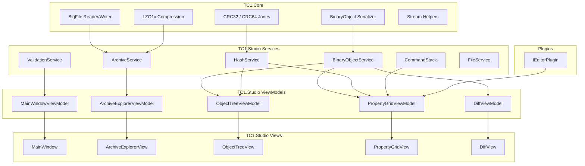
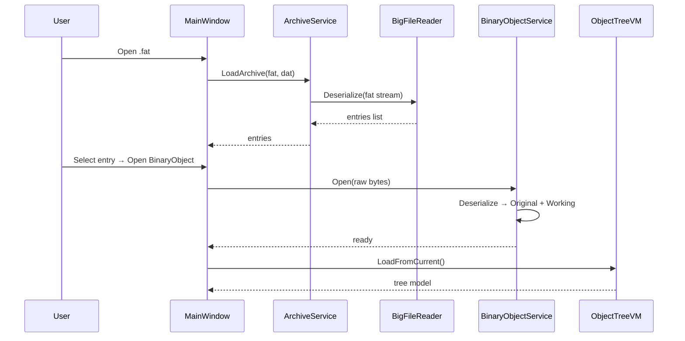
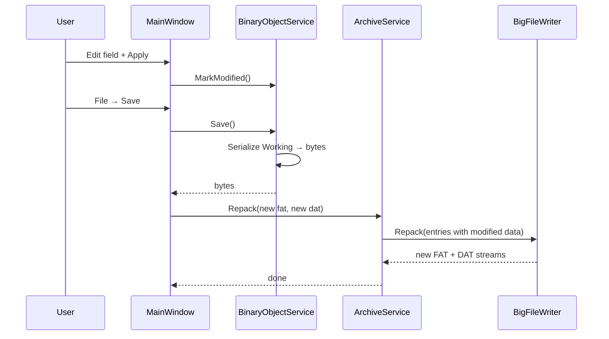

# architecture

## overview

tc1 studio is a gui modding tool for the crew 1. it's split into layers: core (the format stuff) → services (the logic) → viewmodels (state) → views (the actual window).

## read pipeline (opening a file)

## write pipeline (saving)

## design decisions (why it works this way)

- **lossless round-trip** — the parser preserves unknown field hashes, raw bytes, and field ordering. edit one field without corrupting anything else.
- **original + working model** — keeps an immutable copy of the file as it was when opened. diff and reset-to-original compare against this snapshot.
- **layered hash database** — builtin (shipped with the app) → user (your appdata folder) → community (shared packs). your custom names never touch the shipped files.
- **command pattern** — every edit gets pushed to a command stack. undo/redo just reverses field assignments. simple.
- **plugin isolation** — plugins return an avalonia Control. the main app provides the frame, plugins provide the actual editor controls.
